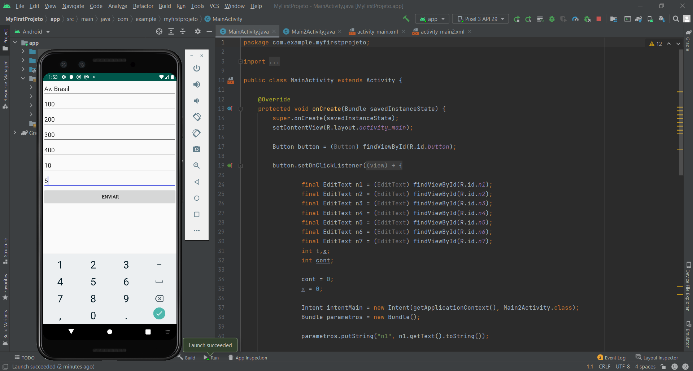
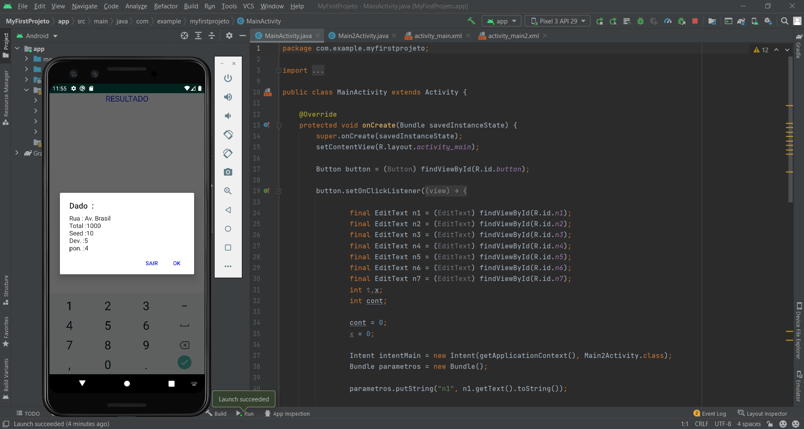
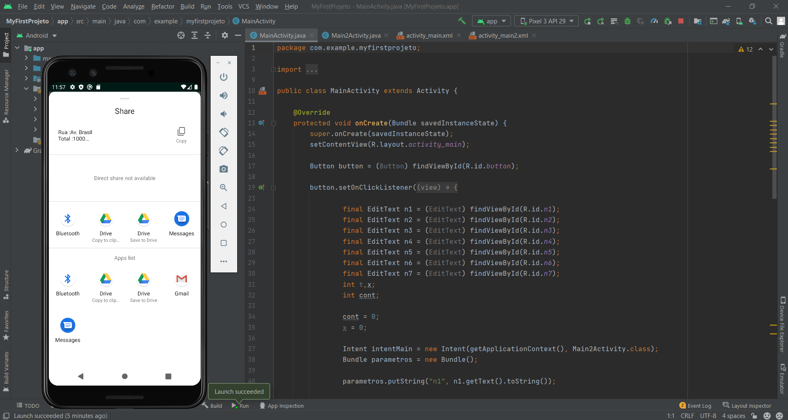

# MyFirstProjeto
Mobile app

## Sobre

Este e um aplicativo mobile desenvolvido com a finalidade de registrar informações sobre atividades desempenhadas em um determinado trecho postal, armazenar em um arquivo local que poderá ser enviado e salvo, utilizando o sistema interno de envio de mensagens do aparelho celular. Este aplicativo interage registrando as informações
e apresentando o resultado final antes de seu envio.

## Informações adicionais

Este aplicativo como qualquer outro desenvolvido por android pode precisar de um permissionamento para acesso as demais funcionalidades do aparelho no qual será utilizado.
Este procedimento e realizado apenas uma vez.

## Layout

  
  
  

## Como execultar o projeto

Para execultar o projeto basta clonar o link direto do github em New no computador no repósitorio de sua preferência, ou se preferir pode fazer o apk do aplicativo
por meio de uma conexão usb entre o aparelho celular e computador que tenha o aplicativo instalado.
